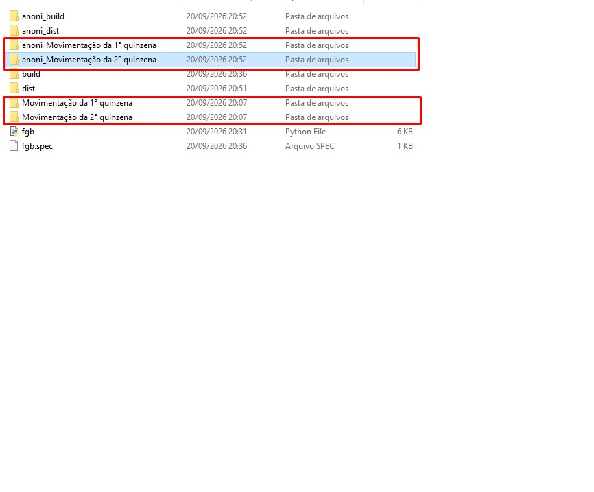
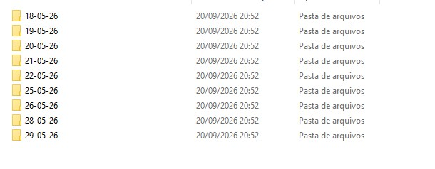

# Anonimizador de PDF

A ferramenta foi desenvolvida em Python para automatizar a identificação e anonimização de dados sensíveis em alguns modelos de documentos.

O projeto foi desenvolvido pensando em uma tarefa repetitiva que poderia demandar bastante tempo quando realizada manualmente: localizar informações pessoais e aplicar redações sobre esses dados.

## Objetivo

Diminuir o tempo gasto na anonimização de documentos recorrentes, como comprovantes e notas fiscais.

## Funcionalidades

* Processamento automático de arquivos PDF;
* Processamento de arquivos localizados em subpastas;
* Preservação dos arquivos originais;
* Criação de cópias anonimizadas;
* Identificação de informações utilizando expressões regulares;
* Localização de elementos por texto e coordenadas;
* Aplicação de redações permanentes sobre informações identificadas;
* Tratamento específico para diferentes modelos de documentos;
* Reprodução da estrutura de diretórios dos arquivos processados.

## Tecnologias utilizadas

* **Python 3** — linguagem utilizada no desenvolvimento da ferramenta;
* **PyMuPDF** — leitura, busca e manipulação de documentos PDF;
* **Regular Expressions (Regex)** — identificação de padrões de informações;
* **pathlib** — manipulação de arquivos e diretórios.

## Uso de Inteligência Artificial

A Inteligência Artificial foi utilizada como ferramenta de apoio durante o desenvolvimento do projeto, principalmente para esclarecer dúvidas, analisar erros, discutir abordagens e auxiliar na revisão do código.

A implementação, testes e validação do funcionamento foram realizados pelo autor.

## Limitações

O programa utiliza regras específicas para determinados modelos de documentos. Portanto, não é um anonimizador universal e não funcionará necessariamente com todos os tipos de documentos PDF.

Documentos digitalizados exclusivamente como imagem podem exigir uma etapa adicional de OCR, que não faz parte da versão atual do programa.

Durante os testes, também foram identificados casos em que a estrutura interna do PDF dificultou a leitura do texto pelo PyMuPDF. Em alguns documentos, o texto foi retornado em uma ordem diferente da disposição visual, o que pode impedir a identificação correta das informações.

## Demonstração

Abaixo estão alguns exemplos do funcionamento do programa utilizando documentos de teste.

### Nota fiscal de serviço

**Antes da anonimização**

**Depois da anonimização**

### Comprovante bancário

**Antes da anonimização**

**Depois da anonimização**

### Criação das pastas

O programa também reproduz a estrutura de diretórios dos arquivos processados.

## Testes

Os testes foram realizados utilizando documentos fictícios ou cópias modificadas de documentos utilizados como referência.

Nenhum dado pessoal real é utilizado na demonstração do projeto.
